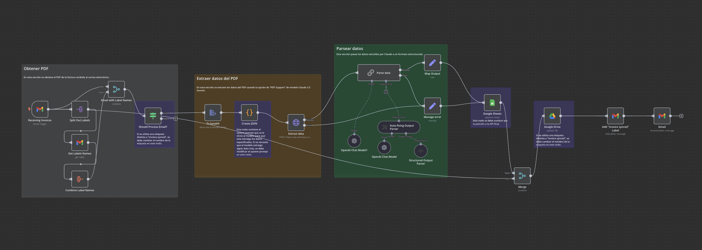

### Procesador Automatizado de Facturas

Ana, una de nuestras alumnas, ha desarrollado un procesador automatizado de facturas en **n8n** que extrae, organiza y almacena datos de facturas recibidas por correo electrónico. Este flujo está diseñado para simplificar la gestión de facturas en empresas. A continuación, se detalla el funcionamiento del proceso:

---

### 1. **Recepción de Facturas**

- **Nodo:** `Receiving Invoices`
- **Función:** Actúa como disparador (trigger) cuando se reciben correos electrónicos en Gmail con facturas adjuntas y una etiqueta específica.
- **Objetivo:** Detectar automáticamente los correos relevantes para procesar.

---

### 2. **Procesamiento de Etiquetas**

- **Nodo:** `Split Out Labels`
  - Divide las etiquetas del correo para su análisis.
- **Nodo:** `Get Labels Names`
  - Obtiene el nombre de las etiquetas asociadas al correo.
- **Nodo:** `Combine Label Names`
  - Combina las etiquetas relevantes para decidir si el correo debe ser procesado.
- **Condición:** Verifica si el correo tiene una etiqueta específica, como "Invoice synced". Si no, ajusta el nombre en el nodo correspondiente.

---

### 3. **Descarga del PDF**

- **Nodo:** `To base64`
  - Convierte el archivo PDF adjunto en un formato base64 para facilitar su procesamiento.
- **Nodo:** `Google Drive`
  - Guarda el archivo PDF en una carpeta específica en Google Drive para mantener un respaldo.

---

### 4. **Extracción de Datos del PDF**

- **Nodo:** `Create JSON`
  - Genera un prompt específico para extraer los datos de la factura. Este nodo es configurable para ajustar el formato de extracción según sea necesario.
- **Nodo:** `Extract data`
  - Usa la API de **Claude 3.5** (Anthropic) para procesar el PDF y extraer los datos clave, como:
    - Fecha de la factura.
    - Nombre del proveedor.
    - Total a pagar.

---

### 5. **Parseo de los Datos**

- **Nodo:** `Parse data`
  - Utiliza un modelo de lenguaje de OpenAI para interpretar los datos extraídos.
- **Detalles Técnicos:**
  - `Auto-fixing Output Parser`: Asegura que los datos tengan un formato correcto.
  - `Structured Output Parser`: Convierte los datos en un formato estructurado.
- **Gestión de Errores:**
  - Si hay un problema durante el procesamiento, se gestiona manualmente a través del nodo `Manage error`.

---

### 6. **Almacenamiento en Google Sheets**

- **Nodo:** `Google Sheets`
  - Inserta los datos procesados de las facturas en una hoja de cálculo de Google Sheets.
  - **Objetivo:** Centralizar los datos en un formato accesible y editable.

---

### 7. **Gestión de Etiquetas**

- **Nodo:** `Add "Invoice synced" Label`
  - Añade una etiqueta al correo para indicar que la factura ha sido procesada.
- **Nodo:** `Remove Label`
  - Elimina la etiqueta original para evitar procesar el correo nuevamente.

---

### Beneficios del Flujo

- **Automatización Completa:** Desde la detección de correos hasta el almacenamiento de datos.
- **Eficiencia:** Reduce errores humanos y ahorra tiempo.
- **Organización:** Centraliza la información en Google Drive y Google Sheets.
- **Personalización:** Fácilmente adaptable a diferentes necesidades empresariales.

---

Este proyecto desarrollado por Ana refleja un excelente uso de herramientas de automatización y modelos de inteligencia artificial, destacando la importancia de la integración entre **n8n**, **Claude 3.5**, y Google Workspace para optimizar procesos empresariales.
