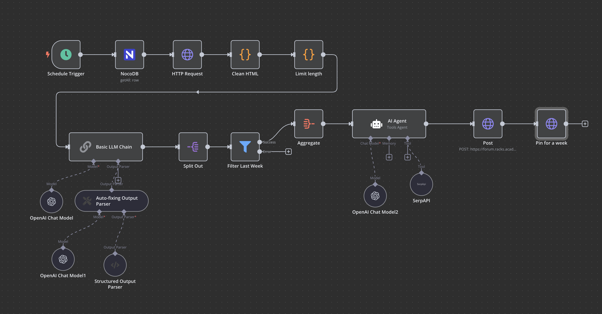

# News Scraper

Este flujo automatizado está diseñado para publicar un resumen semanal de noticias relacionadas con inteligencia artificial en un foro basado en Discourse. A continuación, se describe cada paso del proceso implementado en **n8n**:

---

#### 1. **Schedule Trigger**

- **Función:** Inicia el flujo cada lunes a las 9:00 AM.
- **Objetivo:** Garantizar que la automatización sea recurrente y se ejecute de forma programada.

---

#### 2. **Consulta a NocoDB**

- **Nodo:** `NocoDB`
- **Función:** Obtiene los registros de una base de datos que contiene URLs de páginas web con noticias relacionadas con IA.
- **Detalles:** Recupera todos los registros que contienen enlaces relevantes.

---

#### 3. **Obtención de Contenido Web**

- **Nodo:** `HTTP Request`
- **Función:** Descarga el contenido HTML de las páginas web recopiladas desde la base de datos.

---

#### 4. **Procesamiento de HTML**

- **Nodo:** `Clean HTML`
  - **Función:** Limpia el HTML descargado, eliminando etiquetas innecesarias.
  - **Detalles Técnicos:** Uso de un script personalizado en un nodo `Code` para procesar el HTML.
- **Nodo:** `Limit length`
  - **Función:** Limita el tamaño del texto procesado a un máximo de 10,000 caracteres.
  - **Objetivo:** Preparar el contenido para ser procesado por la IA.

---

#### 5. **Procesamiento con IA**

- **Nodo:** `Basic LLM Chain`
  - **Función:** Usa un modelo de lenguaje (OpenAI Chat Model) para identificar noticias dentro del contenido descargado.
  - **Detalles Técnicos:**
    - Se emplea un `Auto-fixing Output Parser` para asegurarse de que las noticias se estructuren correctamente.
    - Utiliza un `Structured Output Parser` para obtener las noticias de forma organizada.

---

#### 6. **Filtrado de Noticias**

- **Nodo:** `Filter Last Week`
- **Función:** Filtra las noticias para seleccionar únicamente aquellas que fueron publicadas durante la última semana.
- **Objetivo:** Garantizar que el contenido sea relevante y actualizado.

---

#### 7. **Agregación de Noticias**

- **Nodo:** `Aggregate`
- **Función:** Organiza las noticias filtradas en un formato coherente y apto para publicación.

---

#### 8. **Generación de Publicación**

- **Nodo:** `AI Agent`
  - **Función:** Redacta un post en formato Markdown basado en las noticias procesadas.
  - **Detalles Técnicos:** Utiliza un modelo de lenguaje para estructurar la publicación de manera profesional.

---

#### 9. **Publicación en el Foro**

- **Nodo:** `Post`
  - **Función:** Publica el contenido en una categoría específica del foro Discourse.
  - **Detalles:** Utiliza la API de Discourse para enviar la publicación al foro.

---

#### 10. **Pineado del Post**

- **Nodo:** `Pin for a week`
  - **Función:** Fija la publicación en la parte superior de la categoría durante una semana.
  - **Objetivo:** Destacar el resumen semanal de noticias para los usuarios del foro.

---

### Beneficios de la Automatización

- **Eficiencia:** Elimina la necesidad de realizar estas tareas de forma manual.
- **Relevancia:** Garantiza que solo se compartan noticias recientes y relevantes.
- **Consistencia:** Publica contenido en el foro de forma regular y estructurada.
- **Facilidad de Uso:** Redacción automática en formato Markdown para un resultado profesional.

---

### Notas Técnicas

- **Herramientas Utilizadas:** n8n, NocoDB, OpenAI API, Discourse API.
- **Integraciones:** Uso de nodos personalizados y parsers para garantizar resultados precisos.

Esta automatización garantiza una experiencia óptima para los usuarios del foro, al mismo tiempo que simplifica la gestión y publicación de noticias para el administrador.
