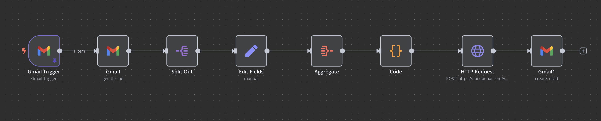

# Flujo de Trabajo de n8n

Este flujo de trabajo permite a los usuarios automatizar tareas y procesos utilizando n8n, una herramienta de automatización de código abierto. A través de una interfaz visual, los usuarios pueden conectar diferentes servicios y aplicaciones para crear flujos de trabajo personalizados.

## Descripción del Flujo de Trabajo

1. **Disparador**: El flujo de trabajo comienza con un disparador que inicia el proceso. Esto puede ser un evento en una aplicación, como la recepción de un mensaje o la creación de un nuevo registro.

2. **Nodos de Procesamiento**: A continuación, se utilizan nodos para procesar la información. Estos nodos pueden realizar diversas funciones, como transformar datos, realizar llamadas a API, o ejecutar scripts personalizados.

3. **Integración de Servicios**: n8n permite la integración con múltiples servicios y aplicaciones, lo que facilita la conexión de diferentes plataformas y la automatización de tareas entre ellas.

4. **Almacenamiento de Datos**: Los datos pueden ser almacenados en bases de datos o enviados a otros servicios para su posterior análisis o uso.

5. **Notificaciones**: Al finalizar el flujo de trabajo, se pueden enviar notificaciones a los usuarios o realizar acciones adicionales basadas en los resultados del proceso.

## Captura de Pantalla

