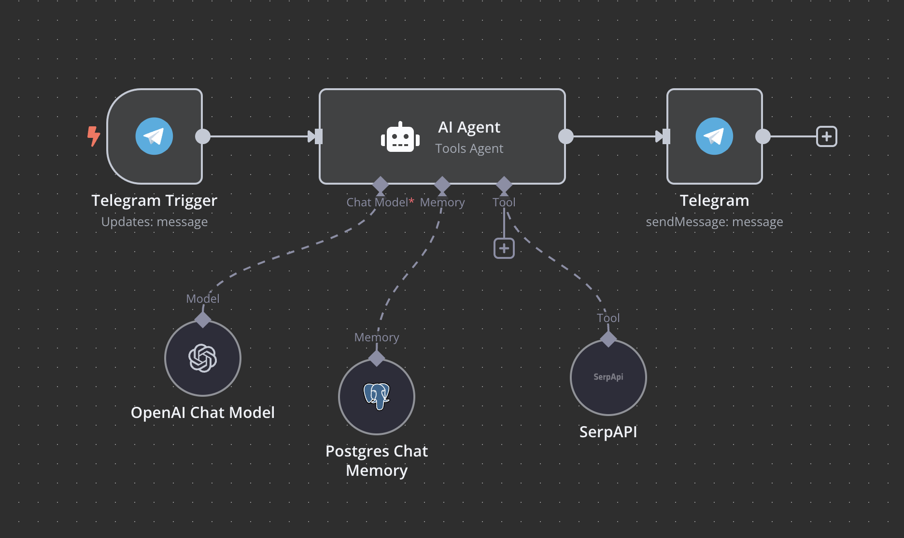

# Chatbot Telegram

Este flujo de trabajo permite a los usuarios interactuar con un chatbot especializado en buscar noticias del mundo del motor, incluyendo automovilismo, motocicletas, lanzamientos de nuevos modelos, avances tecnológicos en motores y eventos deportivos como F1 y MotoGP.

## Descripción del Flujo de Trabajo

1. **Telegram Trigger**: Este nodo se activa cuando se recibe un mensaje en el chat de Telegram. Utiliza las credenciales del bot de Telegram para autenticar las solicitudes.

2. **AI Agent**: Este nodo utiliza un modelo de inteligencia artificial para procesar el mensaje recibido. Se le proporciona un contexto específico que le permite buscar y proporcionar noticias relevantes del mundo del motor. El sistema está diseñado para devolver un resumen de la noticia encontrada junto con un enlace a la fuente.

3. **OpenAI Chat Model**: Este nodo se encarga de generar respuestas utilizando el modelo de OpenAI, asegurando que las respuestas sean coherentes y relevantes.

4. **Memory Postgres Chat**: Este nodo almacena el estado de la conversación en una base de datos PostgreSQL, utilizando un identificador de sesión personalizado para cada usuario. Esto permite mantener el contexto de la conversación a lo largo del tiempo.

## Captura de Pantalla

